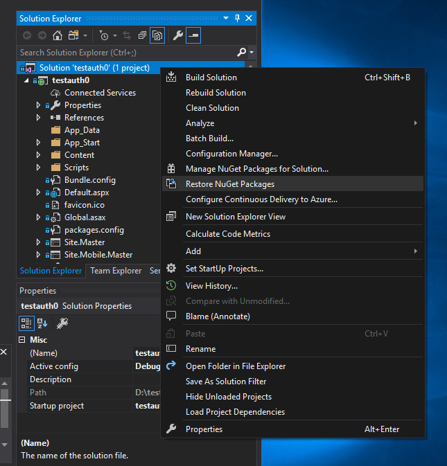
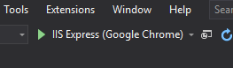
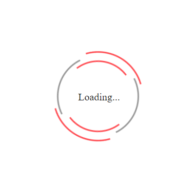
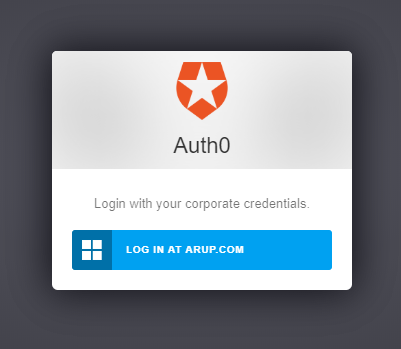

# User Guide

This document will provide a guide on:

- how to add a new custom module on portal.arup.digital and optionally add a config file
- how to use the authenticate library to add authentication to your web application and leverage off portal.arup.digital authentication
- examples of several different server environments and setups used for your web application or content

## Example Templates

### ASP.NET on IIS

The following steps outline how to wrap pages and applications in this ASP.NET example template and use the authenticate library to authenticate with the Portal user management and Auth0.

#### Requirements

- Visual Studio - Visual Studio 2019 (Community) IDE can be installed from: https://visualstudio.microsoft.com/downloads/

#### Instructions

1. Clone this authenticate library to a local directory.

   ```
   git clone https://github.com/ArupAus/authenticate.git
   ```

2. Open `authenticate/Examples/dotnet/testauth0.sln` with Visual Studio.

3. Use Visual Studio's NuGet Package Manager to restore required packages. This can be done by right clicking on the 'testauth0' solution in the Solution Explorer and selecting 'Restore NuGet Packages'. Once restored, ensure all packages are up to date in the NuGet Package Manager.

   

4. Test that the example can be built by Visual Studio and run using 'IIS Express (Google Chrome)' (or similar). This can be done by clicking on the green play button available in the tool bar.

   

5. The example template application should open in a new Chrome browser (or your selected browser). If working, a loading screen (screenshot below) should appear in the browser.

   

   **Note:** If the user has not logged in through Portal and does not have the JWT token in the user's local storage, the login screen below will eventually appear and the user will be prompted to login through Auth0.

   

6. Navigate to and open `testauth0\Default.aspx` in Visual Studio. The variable `pubVar` is a boolean that will switch to true once the user's JWT token is authenticated and confirmed to have access to the corresponding module added in Portal. Insert the code of your application in the first conditional statement (specified below). The second conditional statement will display a loading screen whilst the authentication process is running.

   ```
   <% if (pubVar){%>
       <%-- Insert your application here --%>
       <div>
           config content: <% =testStringConfigText %>
       </div>
       <div>
           Insert your app here...
       </div>
   <%} else {%>
       <%-- Display loading screen whilst authenticating --%>
       <link rel = "stylesheet" type = "text/css" href = "./Content/Loading.css" />
       <div id="loading-wrapper">
           <div id="loading-text">Loading...</div>
           <div id="loading-content"></div>
       </div>
   <%}%>
   ```

7. Publish the project to a folder, then copy this to the wwwroot folder of an IIS Server.

8. On IIS Manager, navigate to the folder you have copied, right click on the selected folder and 'Convert to Application'. This will allow IIS to serve the .aspx and the content of the published folder as an application.

9. On portal.arup.digital, create a new module and select the module type 'Other' and include the URL of your application in the 'URL' text box (e.g. directing to your default.aspx - https://www.arup.com/default). Ensure the 'Custom Configuration' is toggled on. This will give a unique ID to this module, which will be used for the authentication and authorization of your application.

10. Test the application that is published on the IIS Server can now be accessed through Portal, and not accessible if accessed directly via the URL.
